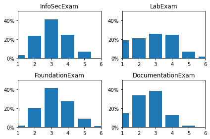
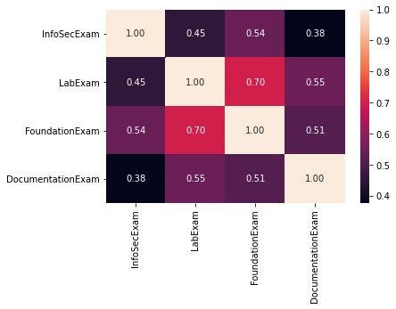
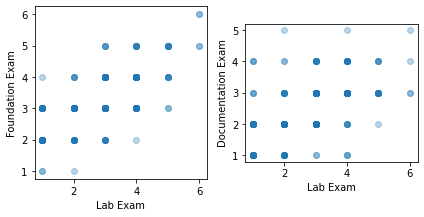

 
# Can You Guess What Your Students Final Exam Grad Will Be? 
 
*Publishing date: 2020-03-04*

*Author:* Florian Steppich, *you can find me on [LinkedIn](https://www.linkedin.com/in/fst/)*

## Introduction 
I am a trainer of aspiring IT Specialists who want to become IT Operative Professionals in Germany. To earn the title of IT Operative Professional a student is required to pass four exams.  To make grading exams – and there are a lot if you run the numbers – more fun, me and my collogues came up with a guessing game.  

The game works as follows. The first three exams (Foundation, Information Security and Documentation) are written exam. The last one is the hands-on Lab exam where the student needs to build a small company network within two hours. Besides paper work, you and your co-examiner have nothing more to do, than wait. Now the fun part.  We once started to infer the lab exam grade by using the previous grades of the particular student.  

Sometimes we were really good in guessing the approximate grade but at other times we totally screwed it. Therefore, I decided to ask the data if it can tell me a way to improve my guess work. 

In particular I asked these three questions: 

* Which exam is the easiest (highest number of passing students and best average grades)? 
* Which exam correlates the most with the Lab Exam grade? 
* Is it possible to predict the grade in the Lab Exam based on other grades? 

By the way, if you are interested in the nitty gritty details of the analysis, go check out this repository on GitHub: https://github.com/fsteppich/UD-DS-ExamGradeAnalysis 

## Q1 Which exam is the easiest? 
By looking at the grade distribution it is fairly easy to spot the exam which concentrates most of grades on the best three grades (1 to 3). 

 

The detailed statistics tells us, that

* the best average grade (2.524) received on the Documentation Exam, 
* the least number of students (1.288%) failed the Documentation Exam, and 
* the greatest number of students (3.258%) failed the Foundation Exam. 

With these results it seems that the **Documentation Exam is the easiest** of the four exams. 

## Q2 Which exam correlates the most with the Lab Exam grade? 
To get a better sense for how strong the exams are related to each other, on easy way is to look at the correlation via a heatmap. 

 

This heatmap shows 

* a highest correlation (.70) between the **Foundation Exam and the Lab Exam**, and 
* the 2nd highest correlation (.55) between the Documentation Exam and the Lab Exam. 

The corresponding scatter plot shows the same as the correlation of .70 suggests: the data point lay slightly on a line. 

 

## Q3 Is it possible to predict the grade in the Lab Exam based on other grades? 
Yes, it is possible. And all this with a fairly simple linear model.  

I also tried a decision tree-based model but the linear one performed on average slightly better than the decision tree. Speaking in numbers, the linear model received an r2 score of 0.51554 while the decision tree model received a score of 0.46748. 

The analysis of these models further showed that the previous experience of a student had no real significance in predicting the final lab exam grade. Following the indication of the previous question, and only using the foundation exam grades to predict the lab exam grade did not improve the r2 score. The best scores where produced by using all of the first three grades. 
 
## Conclusion 
Let's recap the text so far. Next time, I will instruct my students to 

* focus their learning effort on the foundation exam -- as it has the strongest correlation with the final lab exam and 
* grab the low hanging fruits in the easiest-of-all documentation exam. 

Personally, I will go all in with the trained linear model in my hand and win the game.
  
> Can you do the same? 
