

	 

# Are You a Victim of Starbucks Best Offer?

*Publishing date: 2020-07-21*

*Author:* Florian Steppich, *you can find me on [LinkedIn](https://www.linkedin.com/in/fst/)*

## Introduction
As part of my [Udacity](https://www.udacity.com) Data Science Nanodegree I chose to
tackle the Starbucks capstone project as I like the Starbucks brand.

To increase customer engagement, [Starbucks](https://www.starbucks.com/) sends out 
different kinds of offers to customers within their Starbucks rewards mobile app. 
Such an offer can be an advertisement for a coffee, a discount, or buy one get on 
free (BOGO).

Everything costs money, so does sending out an offer to the customer. To 
minimize these costs, it is important to know the answer to these questions:

1. Which kind of offer engages the most customers?
2. Which customer groups are most susceptible to offers?

To find these answers I used a Jupyter Notebook (available on 
[GitHub](https://github.com/fsteppich/UD-DS-CapstoneStarbucks)) and applied the 
cross-industry process for data mining (CRISP-DM) and some machine learning 
algorithms on the data sets provided by Starbucks.

I this article, I will first build a solid understanding of each provided data set 
before I combine these, to represent the timeline of each issued offer. Based on 
this derived data set, I can answer the stated business question. Following these 
answers, I will apply different machine learning models to predict the success of 
an offer based on customer demographics and offer characteristics. To conclude the 
article, I give a list of next actions.

Without further due, let's get started. 

## Understanding the Data <a name="data-understanding">

The provided data is contained in three files:

* portfolio.json - containing offer ids and metadata about each offer (duration, type, etc.)
* profile.json - demographic data for each customer / user
* transcript.json - records for transactions, offers received, offers viewed, and offers completed

### portfolio.json (*10 rows, 6 columns, no rows with NaNs*) 

The offer portfolio has these columns:

* id (string) - offer id
* offer_type (string) - type of offer ie BOGO, discount, informational
* difficulty (int) - minimum required spend to complete an offer
* reward (int) - reward given for completing an offer
* duration (int) - time for offer to be open, in days
* channels (list of strings)

It contains 4 BOGO, 4 discounts and 2 informational offers. 

To distribute these offers, Starbucks always used the email channel in combination with
the mobile app in 90%, the web page in 80% and social media in 60% of the time. Each offer
gets received by the customer at least over 2 channels and 3 channels on average.

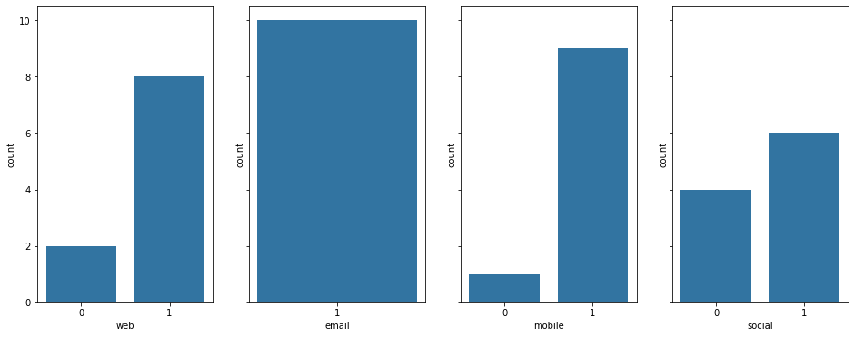

To analyze the channels I transformed the list of the channel column into separate columns
as depicted in the following image.

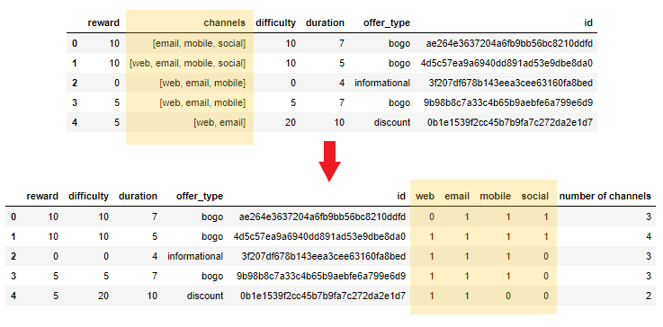

The offers are on average redeemable for 6.5 days and you need to spend between 0$ and 20$ 
(7.70$ on average) to complete it.

### profile.json (*17000 rows, 5 columns, 2175 rows with NaNs*)

The customer profile set contains these columns: 

* age (int) - age of the customer 
* became_member_on (int) - date when customer created an app account
* gender (str) - gender of the customer (note some entries contain 'O' for other rather 
than 'M' or 'F')
* id (str) - customer id
* income (float) - customer's income

The rows containing the NaN values got produced by customers that did not provide
a gender, income, and age. The age column encoded the missing input by setting a 
value of `118`. I replaced this value with a NaN to simplify further analysis.

The biggest portion of users (61.6%) fall in the age group of senior adults (> 50 years). 
Children (< 15 years) are not contained in this data set.

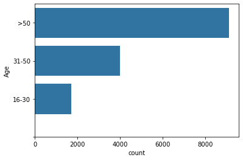

And the age is distributed fairly similar over each gender:

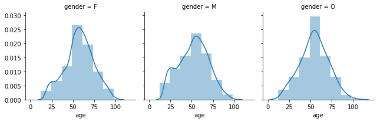

The number of males (8484, 57.2%) and female (6129, 41.3%) is fairly equal but other 
(212, 1.43%) is underrepresented. This is to be considered when building a Machine 
Learning Model.

The income of males is distributed roughly equal in the rage of 25k..75k. The rest 
of the income spectrum is similar to that of the female and others. Female customers
have the highest mean and median income.

Gender | Median | Mean
----|--------|--------
All | 64000.0 | 65404.99
Male | 59000.0 | 61194.6
Female | 71000.0 | 71306.41
Other | 62000.0 | 63287.74

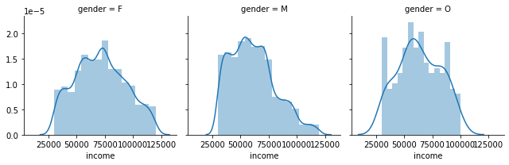

### transcript.json (*306534 rows, 4 columns, no rows with NaNs*)

The transcript contains entries/rows representing events. Some events determine the life 
cycle (receive -> view -> complete -> expired) of an offer. Others signal a transaction 
(a customer buys something). The events got generated during a 4.25 weeks period.

Four columns are present in the file.

* event (str) - record description (ie transaction, offer received, offer viewed, etc.)
* person (str) - customer/user id
* time (int) - time in hours since the start of the test. The data begins at time t=0
* value - (dict of strings) - either an offer id or transaction amount depending on the record

The transcript consists of 45.3% (138953) `transaction` events, 24.9% (76277) `offer received`
events, 18.8% (57725) `offer viewed` events and 11.0% (33579) `offer completed` events. 

To combine the records in this data set with the profile and portfolio data set I 
needed to extract all information from the value column into a corresponding column. 

One issue appeared with the dictionary key of the offer id. Most events used the key 
`offer id` while the `offer completed` event used `offer_id` (with an underscore). 

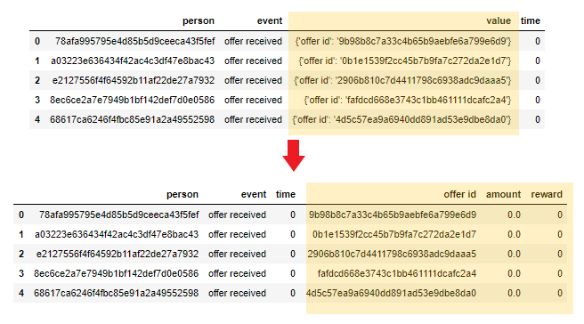

With this, I checked that each offer is nearly equally often represented in the data set.
Actually, this is the case as each offer was received approximately 7627 times with a 
slight variance (standard deviation of 34.8).

### Combining data sets

In the next step, I combined the separate data sets. 

#### Customer Income and Spending
How much did each customer spend during the period presented in the data 
set `transcript`? The total spending can be calculated by summing the `amount` 
column of all records that matches a certain `user id` and the event `transaction`. This
data got stored in a new data set.

Based on this data I calculated the relative spending in permille 
(`spending` / `income` * 1000) during the given 4.25 weeks period. The top 5 customers
spend between 17.6 and 24.4 permille of their income during 4.25 weeks. This equals to 
21.5 and 29.3% per year (assuming a constant purchasing behavior over the whole year). 

A comparison of the spending by gender shows that female customers spend the most (141$),
followed by the gender other (124$). Male customers spend on average the least amount of
money (99$).

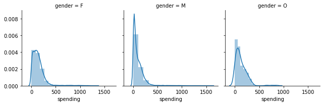

#### Timeline

Now, the most interesting part of the analysis. To get the most of the transcript data
set, I aggregate the events per `user id` and `offer id` to construct a data set of 
timelines representing the 'life cycle' of an offer. The defining events are the 

* `received`,
* `viewed`, and
* `completed` (only for BOGO/discount offers)

event. In addition, I derived the `valid till` column based on the time the offer was 
received plus the duration of that offer. Other columns of the `profile` and `portfolio` 
data set got merged into the new data set to simplify further analysis.

This generated 76277 timeline records, leaving 138953 `transaction` events untouched.

In a second step, I assigned transactions to the corresponding offer by utilizing 
the newly created timeline data set and determined the state of the offer. An offer 
can have three states: `successful`, `not successful`, and `ignored`. 
`Successful` means: after receiving, a user viewed the offer, made some transactions, 
and completed the offer. An offer is said to be `not successful`, if the user received 
and viewed the offer, but made no transaction during the validity period. Offers are 
marked as `ignored` if the user received an offer but did not view it. Let me illustrate
these states:

*Successful*

    `received` -> `viewed` -> `transaction` -> `completed` -> end of validity (BOGO/discount offers)
    `received` -> `viewed` -> `transaction` -> end of validity (informational offers - must be within validity period of offer)

*Not successful (viewed but no transactions)*

    `received` -> `viewed` -> NO transaction -> end of validity
    
*Ignored* (not viewed)

    `received` -> SOME or NO transaction -> end of validity

One particular difficulty arose during the assignment process. It could happen, that one 
transaction can be assigned to multiple offer timelines. This leads to m:n-connection 
between timeline and transaction. E.g. user id `68be06ca386d4c31939f3a4f0e3dd783` had two 
offers, `fafdcd668e3743c1bb461111dcafc2a4` (received at 408) and 
`2298d6c36e964ae4a3e7e9706d1fb8c2` (received at 504), completed at the same instant (552). 
Transactions at 510, 534, and 552 can be assigned to either of the two offers. It is not 
clear from the raw data how to assign these transactions. Therefore I sort the offers on 
the received column prior to processing. The `revenue` column in the data set holds the 
sum over all transaction amounts during the period view-completed/-valid-till (depending 
on offer type). The column `revenue` gives the revenue during the offer period. 
**Attention!**, this causes the sum over all revenue values in the timeline data set to 
be greater or equal to the sum over all amount values of the transaction events!. Assuming 
the latest offer influences the user the most, the transactions get assigned to the 
latest offer if there are more offer candidates to assign to.

In the end:
* 70.03% of all transactions are made in the context of an active offer, and
* 29.97% of all transactions are not in the context of an offer (standalone).

Offers got issued in bulks of about 12.700 instances. The first three issuing times 
are spaced by one week (168h). The remaining three issue times are spaced by roughly half 
a week (72h (43% of one week) and 96h (57% of one week)) from the previous. This pattern
repeats itself for each offer; Each offer gets received roughly the same number of times 
(~1270). This is 1/10 of all received events. 

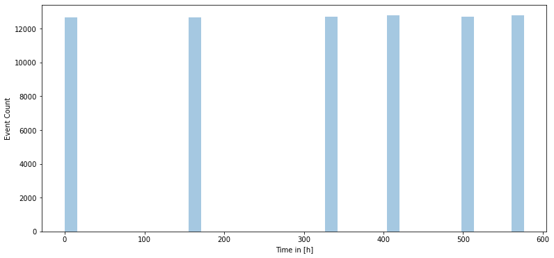

After an initial peak, the number of view events appears to follow an *exponential* decay. 
Chunks of view events are spaced approximately 6h apart. This keeps true in the detailed 
view of each offer.

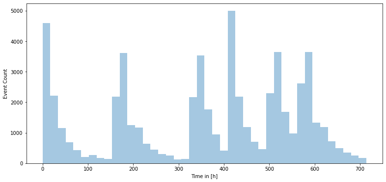

Completion of offers also appears in chucks spaced 6h apart. After an initial peak, the 
number of events appears to follow a *linear* decay. Peaks coincide with the time at 
which the offers get received. The informational offers `3f207df678b143eea3cee63160fa8bed` 
and `5a8bc65990b245e5a138643cd4eb9837` are not shown in the plots as these do not have 
any event completions.

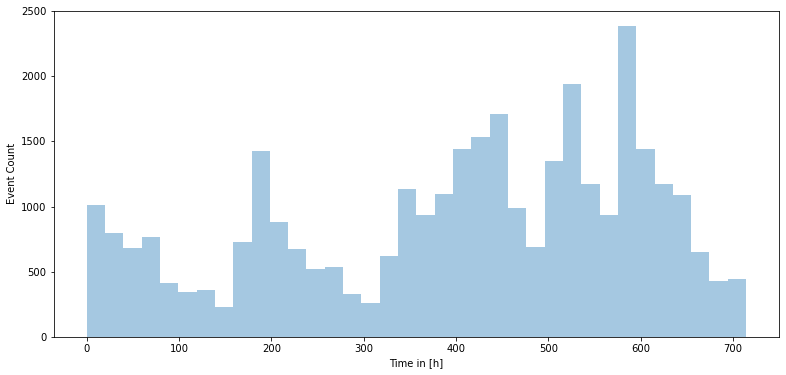

On average, users view bogo offers earlier (mean at 26.3h), followed by discounts 
(mean at 30.5h). Last are informational offers with a mean time to view of 31.6h. 
Completion of bogo offers happens on average around 49.3h and discounts at 73.6h. 
Therefore, bogo offers engage users earlier than discount or informational offers.

Side note: looking at the sorted mean `time to view` or to `time to complete` reveals a  
neat and symmetric pattern of the offer type if you look up and down from the 6th 
(time to view) or 4th and 5th (time to complete, ignoring informational offers).

Mean Time to View:

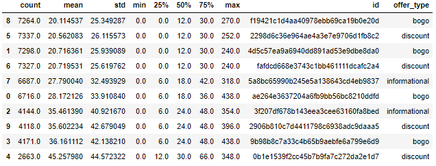

Mean Time to Complete:

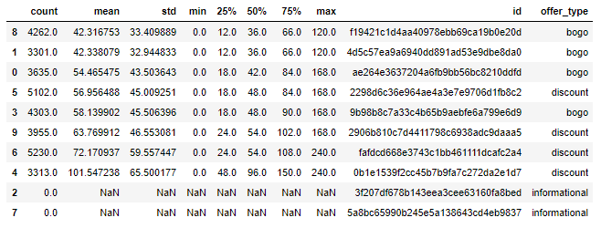

#### Offer State

Of all offers 38% are *successful*, 37% are *not successful* and 24% got *ignored*. Next,
let's analyze the offer states in more detail.

Offers of type *bogo* far more unlikely to be successful (47% of all *bogo* offers are 
not successful) as the other two types. *Discount* and *informational* offers succeed 
at about 40% of the time and are not successful in about 30% of the time.

*Bogo* offers have the lowest rate of ignored offers (16.5%). It might be, that this 
type of offer has a too high difficulty or a too short duration that causes customers to 
fail.

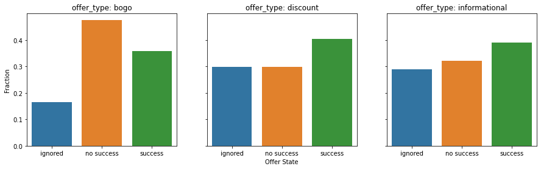

Let's see, if there is a certain combination of `reward` and `difficulty` that tends to 
foster successful, not successful, or ignored offers. To do this, I will plot a heatmap 
of absolute and relative counts of offers. The relative counts are based on the 
absolute number of offers given a certain combination of `reward` and `difficulty`.

The highest *success* rate of 0.6 (60% of all offers) is reached by offers with `reward = 3` 
and `difficulty = 7` (`2298d6c36e964ae4a3e7e9706d1fb8c2` (bogo)). In absolute numbers, 
the highest number of successful offers is with `reward = 2` and `difficulty = 10` 
(`fafdcd668e3743c1bb461111dcafc2a4` and `2906b810c7d4411798c6938adc9daaa5`, both discount).

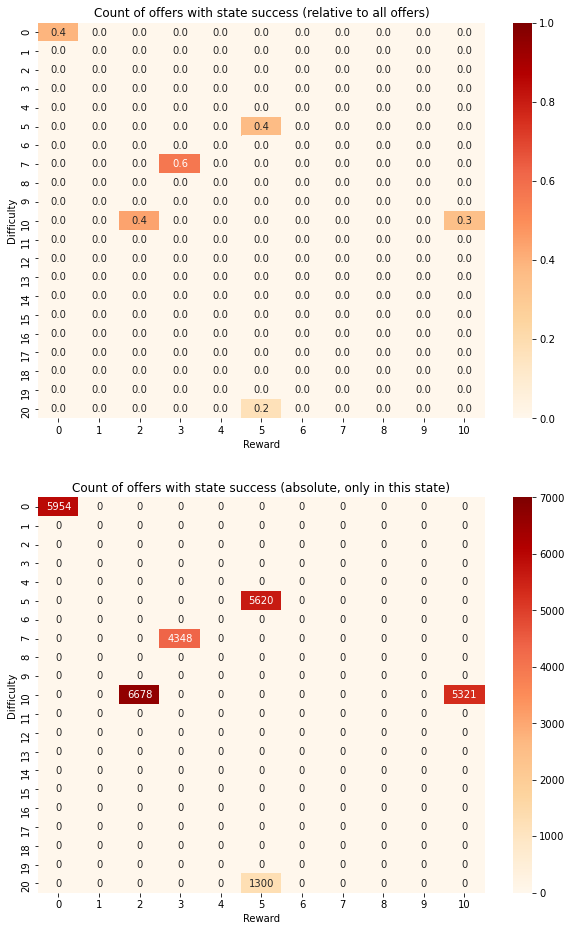

In absolute and relative counts, 8693 and 0.6 (60% of all offers) respectively, the 
highest number of offers beeing *not successful* is found with a combination of 
`reward = 10` and `difficulty = 10` (`ae264e3637204a6fb9bb56bc8210ddfd` and 
`4d5c57ea9a6940dd891ad53e9dbe8da0`, both bogo). This supports the idea, that bogo offers 
are more likely to be not successful.

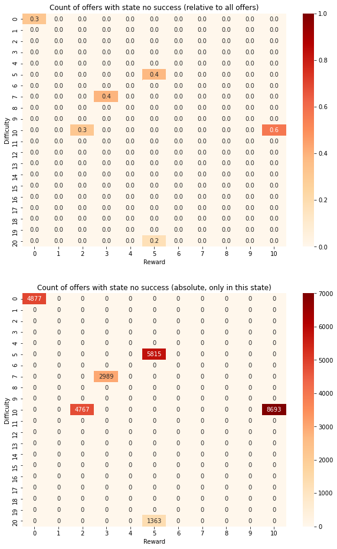

In absolute and relative counts, 5005 and 0.7 (70% of all offers are *ignored*) 
respectively, the highest number of offers is found with a combination of `reward = 5`  
and `difficulty = 20` (`0b1e1539f2cc45b7b9fa7c272da2e1d7` (discount)).

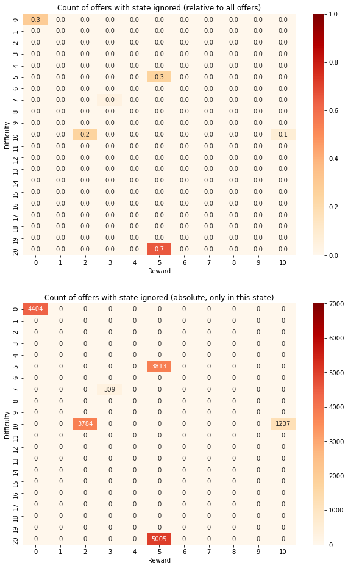

Now, let's turn to the `duration` of an offer. Offers of type *bogo* are issued 
with a duration of 5 and 7 days. A duration of 5 days reduces the likelihood of an 
offer being ignored while the duration of 7 days does not appear to affect the state.
                                              
*Informational* offers are more likely to be ignored if their duration is longer 
(here 4 days). On the other hand, a shorter duration of 3 days decreases this likelihood.
                                              
Different durations seem to not affect *discount* offers.

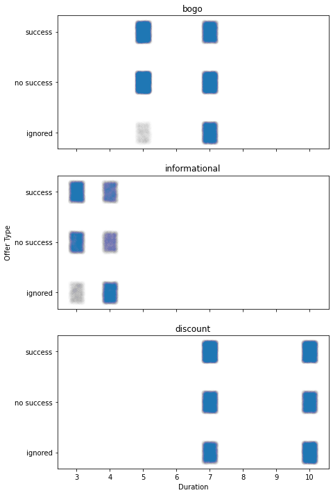

These findings do not support the idea, that bogo offers are not successful due too 
short durations that do not allow the customers to complete in time.

Let's further group the issued offers by `gender` and `offer type` together to reveal 
the influence of these categories on the offer state:

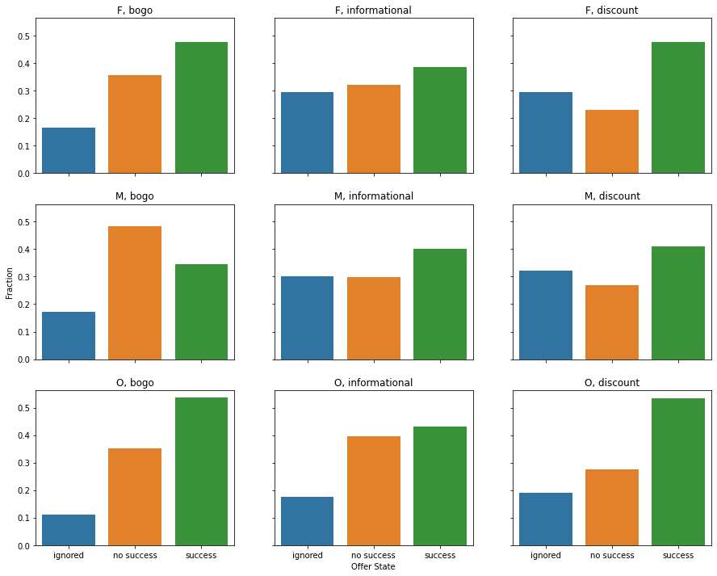

Findings from this plot:
* *bogo* offers are particularly unsuccessful with *male* customers
* *bogo* and *discount* offers are most successful for *female* and *other* customers
* *bogo* offers are ignored the least
* *other* users ignore the least amount of offers
* *informational* and *discount* offers are more likely to be ignored than *bogo* offers
* *informational* offers are approximately as likely to be ignored as not successful 
for *male* and *female* customers
* *discount* offers are more often ignored than unsuccessful by *male* and *female* users

How do the `income` and the spending of users affect the `offer state`? 

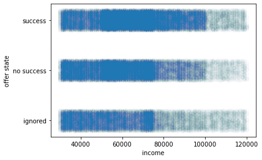

The scatter plot shows that customers with an income of more than 75,000 are more likely 
to not ignore an offer. Below an income of 75,000, the income appears to have no effect 
on whether the offer is in any of the three states. The high concentration of points at 
around 65,000 is due to the filling of the NaN values with the median.

How does the usage of different communication `channel`s influence the `offer state`? 
First, let's see how each channel, in turn, affects the offer state.

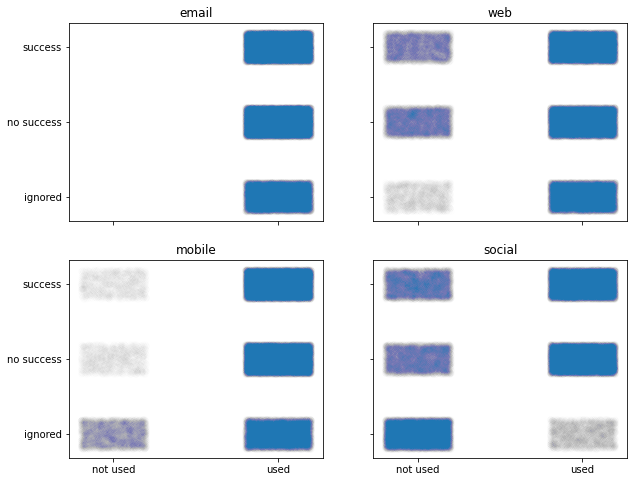

And how the number of used channels affects the offer state.

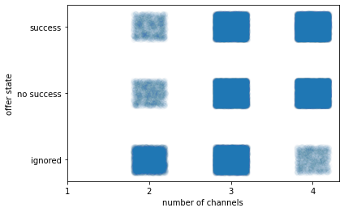

Knowing that each offer got equally often issued and that each channel is used more 
often than not I conclude that:
* Channel *email* can not be used to discriminate between the offer states (channel 
is always used)
* Not using channel *web* leads to more (un)successful offers than ignored ones
* Not using the *mobile* channel leads to ignored offers
* Not using the *social* channel leads to ignored offers and using it to  more 
(un)successful offers than ignored ones
* Using only 2 channels tends to offers being ignored
* Using all 4 channels reduces the likelihood of an offer being ignored

#### Revenue

Now let's take a closer look at the generated `revenue`:

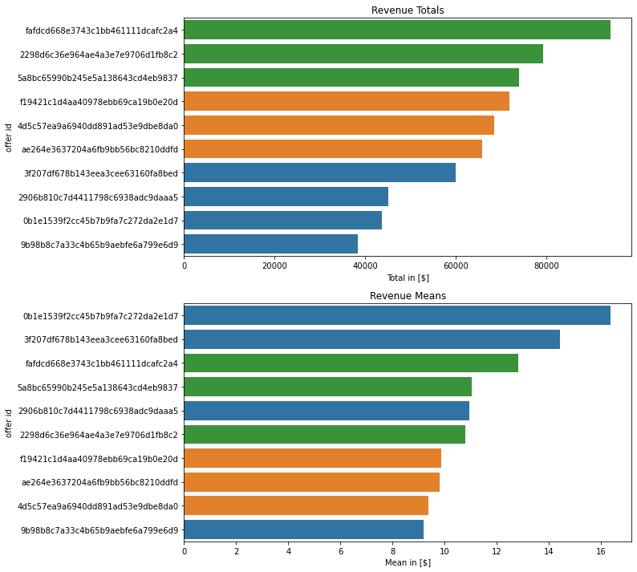

The totals of the revenues support the intuition that successful offers generate 
the most revenue and ignored ones the lowest. But this pattern does not repeat in 
the plot of the revenue means. Remarkably, the two offers with the highest 
revenue means are ignored ones. But it makes sense, as offer 
`0b1e1539f2cc45b7b9fa7c272da2e1d7` has the single highest `difficulty` (minimum 
required to spend to complete an offer) of 20.

#### Answering the Business Questions

With the previously gained insights it is now possible to answer the initially stated
business questions:
 
**1. Which kind of offer engages the most customers?** 
    *Bogo* offers have the highest rate of success (60%) and the lowest chance of being 
    ignored (16.5%). On the other hand, the highest revenue gets generated with 
    *discount* offers. To reduce the number of ignored offers, it is advisable to use 
    all four channels of communication  (web, email, social, and mobile). Offers with 
    a *reward* between 2 and 3 and *difficulty* between 7 and 10 makes them more likely 
    to be completed successfully. A *difficulty* of 10 or higher makes offers less likely 
    to be successful. This negative effect can not be compensated with a higher *reward*. 
    Shorter durations reduce the likelihood of *bogo* and *informational* offers being 
    ignored. The offer state of *discount* offers is not affected by the duration.

**2. Which customer groups are most susceptible to offers?** 
    Customers of gender *female* and *other* are more likely to complete offers 
    successfully (45% and 51% respectively) while they spend more than *males*. *Female* 
    and *other* customers prefer *bogo* and *discount* offers. *bogo* 
    offers are particularly unsuccessful with *male* customers. But customers with 
    gender *other* are most likely to react on any offer. Customers with an income above 
    75,000 reduce the likelihood of an offer being ignored. But an income below this 
    threshold does not appear to affect the success of an offer.
   
## Preparing the Data for Machine Learning

The previous section revealed many insights into the provided data sets. In addition, I 
generated some new data sets of which the one containing the life cycle of an offer 
(from receiving an offer to its completion) is to be prepared for the machine learning
algorithms.

Issues I addressed in this part are:

* encode the `offer type` into a numeric form in column `offer_type_num`
* encode the `gender` into a numeric form in column `gender_num`
* encode NaN values in `gender` column as an additional gender (0, zero) in 
	column `gender_num`
* fill NaN values in `age` column with the mean age
* fill NaN values in `income` column with the median and normalize on the maximum

From a business point of view, an unsuccessful (viewed but no money spend) and an ignored 
offer did not foster customer engagement. Only offers with state successful are also 
successful from the business, as they engaged the customer and rewarded him/her. Therefore 
increasing customer satisfaction. This view will be encoded in the column `engaged`.

This process produced the following classes:

Offer Type (encoded):

Encoding | Count
--- | ---
3 (discount) | 30543 (40.0%)
2 (bogo) | 30499 (40.0%)
1 (informational) | 15235 (20.0%)

Gender (encoded):

Encoding | Count
--- | ---
3 (male) | 38129 (50.0%)
2 (female) | 27456 (36.0%)
0 (unset) | 9776 (12.8%)
1 (other) | 916 (1.2%)

Engaged:

Encoding | Count
--- | ---
0 (no) | 47056 (61.7%)
1 (yes) | 29221 (38.3%)

## Modeling the Data with Machine Learning (Classifier)

The machine learning models build are based on the algorithms implemented in the classes
`DecisionTreeClassifier`, `RandomForestClassifier`, and `KNeighborsClassifier` of the 
scikit-learn python package. They get employed to predict the two targets `offer state` 
and the user engagement (`engaged`) given details about the offer and the customer. 

I selected the features according to the findings provided in the section 
[Understanding the Data](#data-understanding) or the section summary of *2. Data 
Understanding* in the Juypter Notebook as these features appear to have the most 
influence on the offer state.

A grid search is applied to find the best parameters for each classifier. And the data
set got split between a training set (containing 57207 records) and a test set (containing
19070 records).

The best training score on the target `offer state` was calculated for the 
`RandomForestClassifier` with a weighted average f1-score of 0.58. The overall best 
training f1-score (weighted average) of 0.69 got calculated on the target `engaged` 
for the `RandomForestClassifier`. 

All trained models got stored/pickled in corresponding files for later usage.

## Evaluating the Models

To get a sense of the scores obtainable by a naive classification approach I implemented 
a classifier based on the empirical distribution of the targets. This classifier assigned
the target class solely by the fitted distribution.

On `offer state`, `DecisionTreeClassifier` and `RandomForestClassifier` scored equally 
with a weighted average f1-score of 0.57. But these were only slightly better than 
`KNeighborsClassifier` with a weighted average f1-score of 0.54. 

On `engaged`, `DecisionTreeClassifier` had the highest weighted average f1-score of 
0.68, closely followed by `RandomForestClassifier` with 0.67. But these were only 
slightly better than `KNeighborsClassifier` with a weighted average f1-score of 0.64. 

Both are better than the naive approach of randomly assigning the target class according 
to the empirical distribution. Therefore I recommend using the `DecisionTreeClassifier` 
to predict user engagement, as this classifier scores equally well and is 
computationally less expensive than the `RandomForestClassifier`.

## Next Actions

The employed classifiers had a hard time finding a solid correlation between customer 
demographics, offer characteristics and the offer state/customer engagement. 
Therefore I recommend the following next actions:

* Consider the findings of the section [Understanding the Data](#data-understanding) or  
	the section summary of *2. Data Understanding* in the Juypter Notebook, when issuing 
	new offers. This could further be refined into an automatic mechanism that...
* ... generates customer-tailored offers (difficulty, type, ...) based on the curated 
	timeline data.
* Apply other machine learning methods to better predict the offer state/customer 
	engagement. One such method might be to implement a recommendation engine (e.g. 
	User-User Based Collaborative Filtering) that recommends offers from the portfolio 
	according to customer demographics and previous success rates.
* Try to predict the revenue a customer might generate based on customer demographics 
	and offer characteristics.

And finally:

> Are You a Victim of Starbucks Best Offer? I am ;-)
